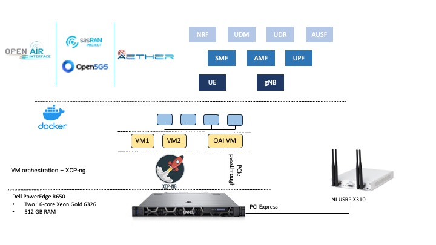
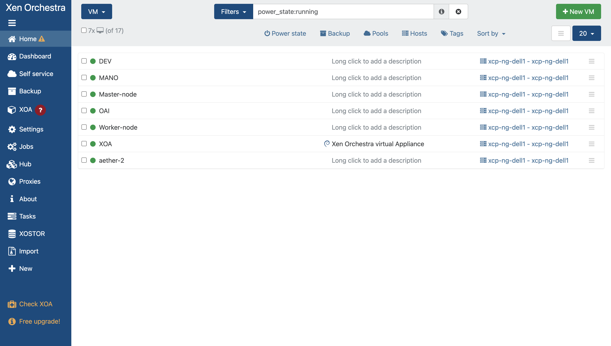
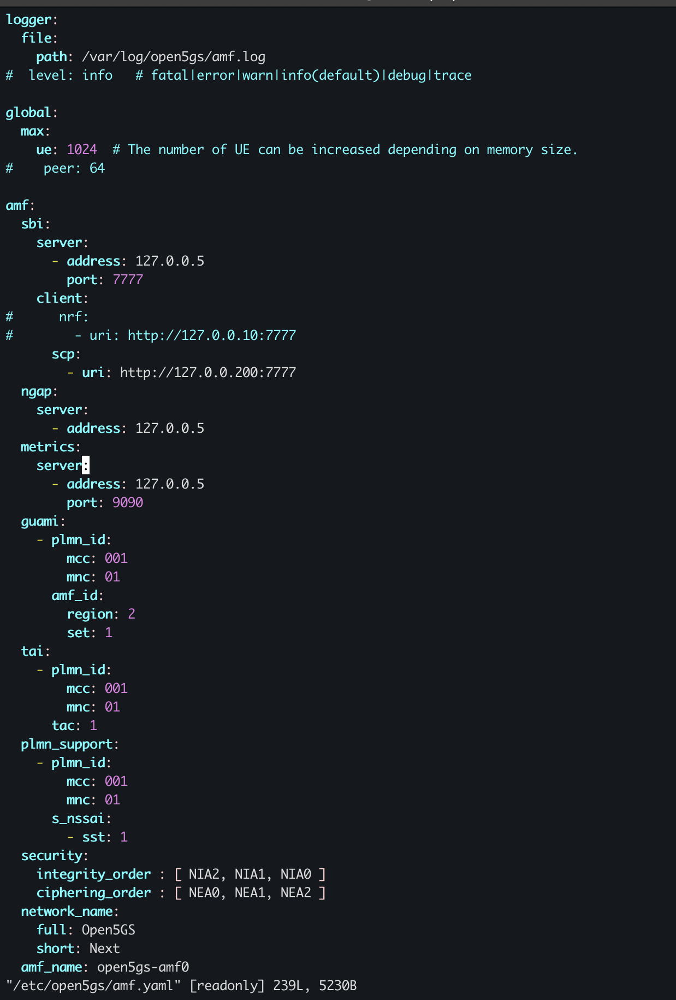
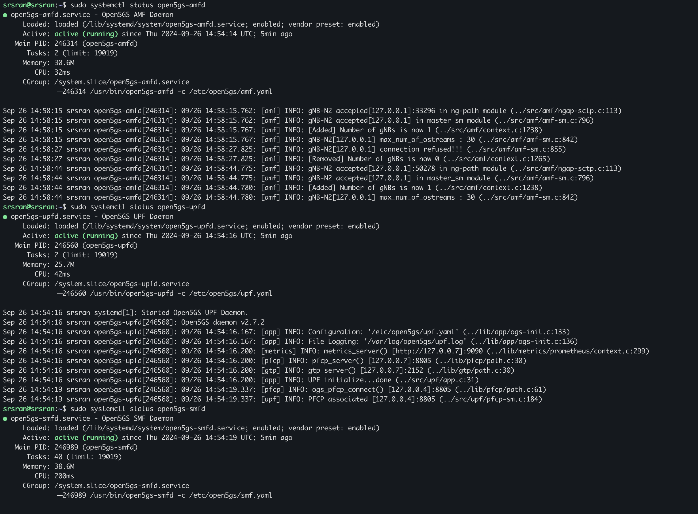
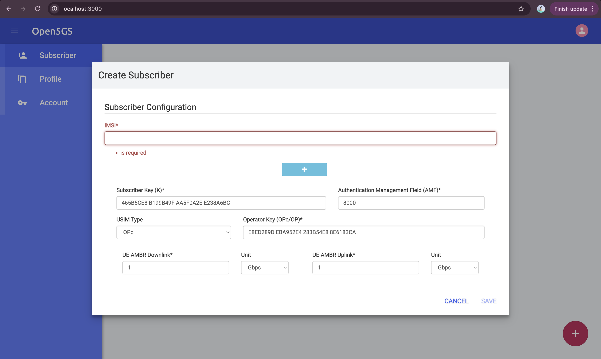
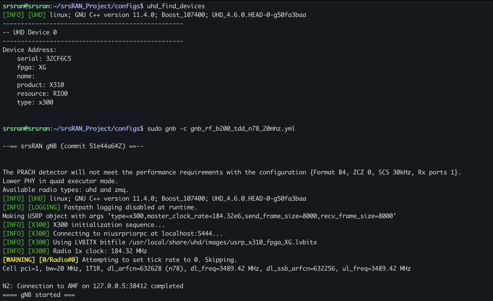
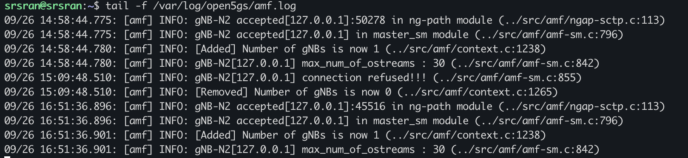

# Testbed Access and 5G Stacks Deployment and Implementation

## TestBed Access and VM Creation

The architecture shown in the image below involves a testbed setup designed for running 5G core and radio access network (RAN) components using various technologies, managed by XCP-ng and supporting NI USRP X310 through PCI passthrough for software-defined radio (SDR) based implementation. With this understanding of the architecture, the next step would be creating the VMs in XCP-ng.



### XCP-ng Overview

[**XCP-ng**](https://docs.xcp-ng.org/)  is an open-source hypervisor platform that enables virtualization. It is built on top of the Xen Project and provides a robust and scalable solution for managing virtualized environments. 

**Xen Orchestra (XOA)**: A web-based interface used to manage XCP-ng hypervisors, perform VM creation, and manage resources.

### VPN Access to XOA Dashboard (10.80.103.47)

Ensure you are connected to the VPN that provides access to the `10.80.103.47` network (where Xen Orchestra is hosted).

1. Access the Xen Orchestra dashboard by visiting `http://10.80.103.47` via a web browser. You will need to authenticate with the appropriate credentials.
2. Once logged in, you will see the dashboard as shown in the screenshot provided.



### Creating a VM in XCP-ng via Xen Orchestra

1. From the Xen Orchestra dashboard, click on the green button labeled `+ New VM` (top-right corner).
2. Select a template or ISO for the new VM (Ex: a Linux or Windows template).
3. Configure the VM settings:
   - **Name**: Give the VM a recognizable name.
   - **Template**: Choose a template if available, or upload an ISO.
   - **CPUs and RAM**: Allocate the number of vCPUs and amount of RAM based on your needs.
   - **Storage**: Choose or create a virtual disk to allocate storage space.
   - **Network**: Attach the VM to a network that allows connectivity within the virtualized environment.
4. Complete the setup by reviewing and confirming the settings.
5. Start the VM from the dashboard once it's created.
6. IP will be assigned through DHCP and can be accessed via SSH.

**Note**: [PCI Passthrough for Ettus X310 Device to VM](https://docs.xcp-ng.org/compute/) (Verify through CMD: `lspci -k` or `uhd_find_devices` for USRP)

---

## Steps to Deploy and Run srsRAN 5G in XCP-ng VM

Deploying [**srsRAN 5G**](https://docs.srsran.com/projects/project/en/latest/general/source/1_getting_started.html) and running it in an XCP-ng VM involves creating a suitable VM in XCP-ng, configuring, and running the srsRAN software. This setup will allow you to simulate and test 5G networks using SDRs like the USRP X310 (through PCI passthrough) or even without SDRs by using simulators.

### Create a New VM

1. On the Xen Orchestra dashboard, click the `+ New VM` button.
2. Choose a Linux template such as **Ubuntu 22.04** (or another supported distribution for srsRAN) from the list.
3. Configure the VM settings:
   - **vCPUs**: Allocate at least 4–8 virtual CPUs to handle real-time processing of srsRAN.
   - **Memory**: Allocate at least 8 GB of RAM.
   - **Storage**: Assign at least 50 GB of storage for the operating system and srsRAN software.
   - **Network**: Assign a network interface that allows communication between VMs and external interfaces or keep it default.
4. Start the VM, and install the operating system (Ubuntu 22.04 is recommended) via the ISO you selected.

**Note**: This guide provides a comprehensive overview of installing [srsRAN Project](https://docs.srsran.com/projects/project/en/latest/user_manuals/source/installation.html#manual-installation).

---

### Running srsRAN

To successfully run an end-to-end network using the srsRAN Project applications, you will need the following (Recommended by srsRAN):

- A PC with a Linux-based OS (Ubuntu 22.04 or later) - We covered this with the VM setup.
- A USRP device - Covered by connecting the **USRP X310** to the VM via PCI passthrough.
- **srsRAN Project** - Installed by following instructions from the guide.
- A **5G Core** (srsRAN recommends **Open5GS**): Follow [this link](https://open5gs.org/) to install and configure.

---

### Installing Open5GS (5G Core)

**Open5GS** implements the 5G core components (AMF, UPF, SMF, NRF, AUSF, UDM, etc.). Deploying Open5GS allows you to build your own 5G core network, integrate it with gNBs (New Radio), and test end-to-end connectivity between UEs and external networks.

1. To edit any core network function configuration file, for example:
   Modify `/etc/open5gs/amf.yaml` to set the NGAP IP address, PLMN ID, TAC, and NSSAI.



See the screenshot below of successfully running Open5GS.



2. Add subscriber details in the Open5GS dashboard where it is deployed in the VM (`localhost:9999`). Can be accessed locally through the following command:
   ```bash
   ssh -L 3000:localhost:9999 srsran@10.80.103.130
   ```

---


### 5G UE and System Tuning

- A **3rd-party 5G UE** - We covered this with **COTS UE**.

Run the script as follows from the main project folder to tune your system for the best performance:
```bash
sudo ./scripts/srsran_performance
```

Once the configuration is complete, you can start the various components of srsRAN.

### Running the gNB

Run the gNB using the configuration file below by navigating to the srsRAN project’s configuration folder:
```bash
sudo gnb -c gnb_rf_b200_tdd_n78_20mhz.yml
```

Once the gNB is running, you should see the following output:

---


If the connection to the core is successful you should see the following from the AMF log:


### Connecting to the Network

The **COTS UE** can now search for the network. If the device can successfully receive SIBs and "see" the network, it will appear in the list of available carriers. It will be displayed as **Open5GS 5G** or **00101 5G**. If your PLMN is something else, it may be displayed as `[PLMN] 5G`.

